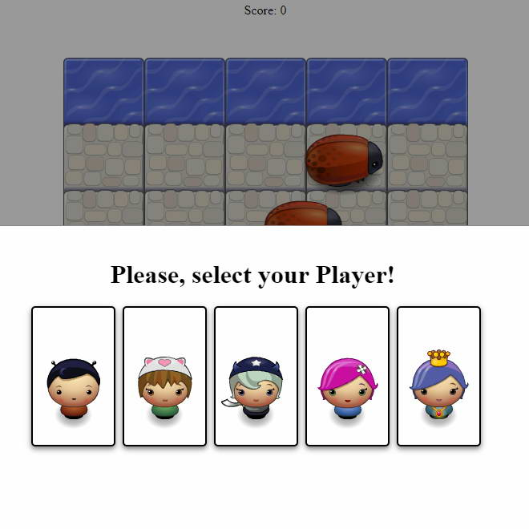
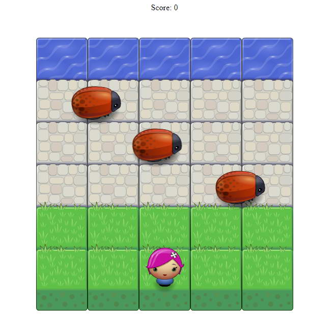

#Classic Arcade Game Project

##Table of Contents
<!-- TOC depthFrom:1 depthTo:6 withLinks:1 updateOnSave:1 orderedList:0 -->

- [Classic Arcade Game Project](#classic-arcade-game-project)
	- [Table of Contents](#table-of-contents)
		- [What is the Classic Adcade Game](#what-is-the-classic-adcade-game)
		- [How to Player](#how-to-player)
		- [Gameplay](#gameplay)
		- [Challenge](#challenge)
		- [Required dependencies](#required-dependencies)

<!-- /TOC -->
###What is the Classic Adcade Game

It is an easy game where you can test your reflexes.

###How to Player

You can reach the game here: https://schwaott.github.io/frontend-nanodegree-arcade-game/

 

###Gameplay

Choose you character for starting game. You can move for the 4 main direction (up, down and right, left) within the game field. When you have reached the water you earn score.

###Challenge

Try to reach the water without colliding with bugs.

###Required dependencies

Use the latest version of your browser.
